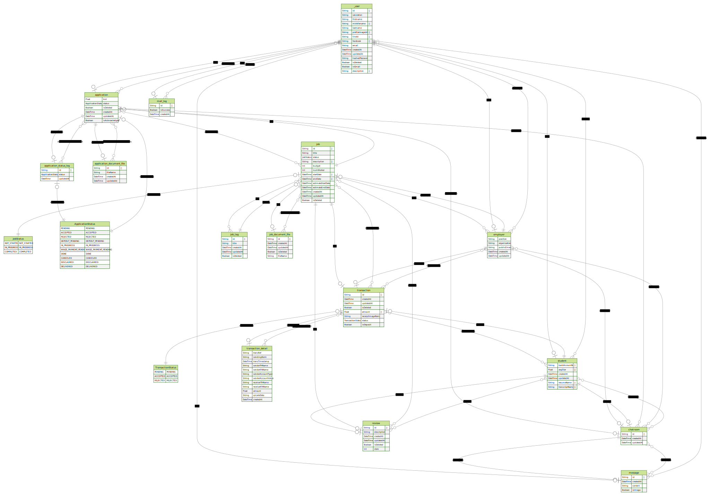

# Database

  
Table of Contents

  <ul>
    <li>
      <a href="#v100">v1.00</a>
      <ul>
        <li><a href="#v110">v1.10</a></li>
        <ul>
          <li><a href="#v111">v1.11</a></li>
          <li><a href="#v112">v1.12</a></li>
          <li><a href="#v113">v1.13</a></li>
        </ul>
        <li><a href="#v120">v1.20</a></li>
        <ul>
          <li><a href="#v121">v1.21</a></li>
          <li><a href="#v122">v1.22</a></li>
          <li><a href="#v123">v1.23</a></li>
          <li><a href="#v124">v1.24</a></li>
        </ul>
        <li><a href="#v130">v1.30</a></li>
        <ul>
          <li><a href="#v131">v1.31</a></li>
          <li><a href="#v132">v1.32</a></li>
          <li><a href="#v133">v1.33</a></li>
          <li><a href="#v134">v1.34</a></li>
          <li><a href="#v135">v1.35</a></li>
          <li><a href="#v136">v1.36</a></li>
          <li><a href="#v137">v1.37</a></li>
        </ul>
      </ul>
    </li>
  </ul>

## Current Database Schema

> _automatically-generated_ from Prisma Database Schema

## v1.00

- init version as copied from the existed docs

(<a href="#database">back to top</a>)

## v1.10

### User

- `email` is set to not required
- `hashedPassword` is added as VarChar(512)
- `isGmail` is added as boolean with default as false

### Job

- Change the relation to `JobTag` to `Many-to-One`
- Change the FK reference from `userId` to `employerId`

### JobTag

- `title` is set to required

### Application

- `appliedAt` is removed, use `createdAt` instead
- `bid` is set to required

### Message

- `timestamp` is removed, use `createdAt` instead

### Transaction

- `employerId` is removed as we can use `jobId.employerId`

### Review

- `studentId` is added

### ApplicationStatus

- Add `ed` to enums

### Etc.

- `isDeleted` is added for the deletion in `User, Job, JobTag, Applied, Transaction, Review` for referential integrity contraint
- Change table name from `Applied` to `Application`

(<a href="#database">back to top</a>)

## v1.11

### User

- Change the FK format to `Student` and `Employer`

### Etc.

- Change the name convention of the relation name
- Refactor the seeding file to be `Student` and `Employer` based instead of `User` based
- Fix the `npx prisma generate`

(<a href="#database">back to top</a>)

## v1.12

### Job

- `description` is set to not required
- `descriptionUrl` is added and not required

(<a href="#database">back to top</a>)

## v1.13

### Job

- `descriptionUrl` is deleted

### JobDocumentFile

- This table is added for storing multiple files in a single job

(<a href="#database">back to top</a>)

## v1.20

### JobDocumentFile

- `fileUrl` is changed to `fileName`

### Application

- `isAcknowledged` is added and set default to false
- `documentUrl` is deleted as we use the serepate table (ApplicationDocumentFile) instead

### ApplicationDocumentFile

- This table is added for storing multiple files in a single application

### Transaction

- `paymentId` is deleted
- `receiptImageUrl` is changed to `receiptImageName` and set to required
- `employerUserId` is changed to `employerId` and set to required
- `paymentType` is deleted as we only have one type - promptpay qr
- `status` is added and set default to `PENDING`
- `amount` is added and set to not required

### ApplicationStatus

- edited as requested from backend team

### TransactionStatus

- consists of `PENDING`, `ACCEPTED`, and `REJECTED`

(<a href="#database">back to top</a>)

## v1.21

### Transaction

- `isDeposit` is added

### MailLog

- This table is added for keeping track of emails sended from the system

### ApplicationStatus

- `DISCLAIMED` is added
- `DELIVERED` is deleted

(<a href="#database">back to top</a>)

## v1.22

### ApplicationStatus

- `DELIVERED` is added back due to the code dependency, maybe revert back later

(<a href="#database">back to top</a>)

## v1.23

### TransactionDetail

- This table is added and it will be served for storing transaction details in the case where that transaction is successfully verified by api

(<a href="#database">back to top</a>)

## v1.24

### TransactionDetail

- `receiverAccountType` is deleted as the api response contains only an empty string
- `receiverAccountValue` is deleted as the api response contains only an empty string
- Add mapping to `transaction_detail`

### MailLog

- Add mapping to `mail_log`

(<a href="#database">back to top</a>)

## v1.30

### Student
- `resumeUrl` is changed to `resumeName`
- `transcriptUrl` is changed to `transcriptName`

### Chatroom
- Removed the relation to `Job` table, and changed to `Application` table instead.

### Message
- `unsentAt` and `updatedAt` are deleted as it is optional features
- `content` and `isImage` are added for storing the content of the message instead of using other tables (Text, Image)

### Text
- This table is deleted as it is not nessessary

### Image
- This table is deleted as it is not nessessary

(<a href="#database">back to top</a>)

## v1.31

### Student
- `description` is added

(<a href="#database">back to top</a>)

## v1.32

### Student
- `avgStar` is deleted

### Chatroom
- `employerId` is added 
- `employer` and `student` relation are added for easier in query for list of chatrooms related to the current user

(<a href="#database">back to top</a>)

## v1.33

### TransactionDetail
- `transRef` is set to unique to prevent duplication of payment slip 

(<a href="#database">back to top</a>)

## v1.34

### ApplicationStatusLog
- This table is added for keeping track of `ApplicationStatus` of the particular `Application`

(<a href="#database">back to top</a>)

## v1.35

### MailLog
- `id` is set to use uuid() for default value

### ApplicationStatusLog
- This table name is mapped to `application_status_log`
- `id` is set to use uuid() for default value

### Application
- The trigger is added to log in `ApplicationStatusLog` when there is an update of `status` on `Application`

### Other
- Manually squash old migrations for cleaner migrations history files 

(<a href="#database">back to top</a>)

## v1.36

### Application
- The trigger is added to log in `ApplicationStatusLog` when there is an insert on `Application`

(<a href="#database">back to top</a>)

## v1.37

### User
- `description` is added

### Student
- `description` is deleted as it has been moved to `User` table

(<a href="#database">back to top</a>)
